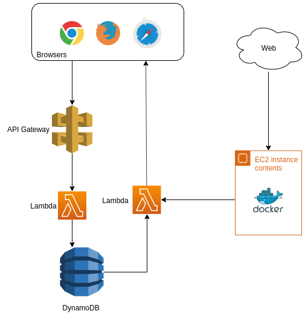

  
  

# Source Code

This app was completely rewritten and migrated to the following repos:
 - [backend](https://github.com/andrelopesmds/goalstracker-api)
 - [frontend](https://github.com/andrelopesmds/goalstracker-app)

# GoalsTracker's overview

Track your favorite team and send web push notifications when a match starts, ends or the team scores a goal.

User subscribes to web push notifications on a responsive website. A crawler running on the server side harversters the web for matches events. Another service notifies the subscribers when an event occours.

<table cellspacing="0" cellpadding="0" style="border-collapse: collapse; border: none;">
  <tr>
    <td align="center" valign="center">
      
       
    </td>
    <td align="center" valign="center">
      
       
    </td>
  </tr>
</table>

## Architecture

The application runs on AWS. An S3 bucket hosts the static Frontend. When the user subscribes to the service, a service worker is installed on the browser and its subscription is sent to the Backend. The request reaches the API Gateway and then a lambda function (Subscriber) saves the subscription into DynamoDB. Meanwhile, CloudWatch starts a crawler (Fetch) every certain minute to harvest the web for matches events and then saves them into DynamoDB. Once an event is added, DynamoDB triggers a Lambda function (Dispatcher) to gather active user's endpoints and sends a pair of event/subscription to another lambda (Push). Finally, the lambda (Push) sends the web push notification to the browser with its respective subscription. On the browser, the service worker pops up the notification.

  

