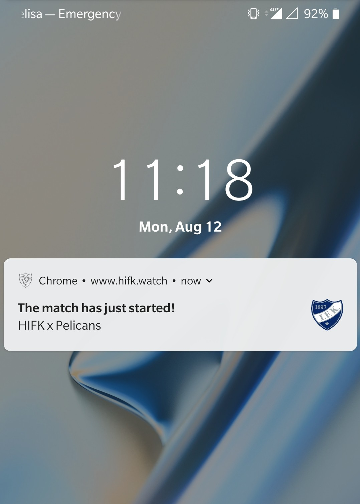

Tracks your favorite team and sends web push notifications
when a match starts, ends or the team scores a goal.

User subscribes to web notifications on a responsive website
developed using Bootstrap. A crawler running on the server
side harversters the web for matches events. Another service
notifies the subscribers when an event occours.

<table cellspacing="0" cellpadding="0" style="border-collapse: collapse; border: none;">
  <tr>
    <td align="center" valign="center">
      
       
    </td>
    <td align="center" valign="center">
      
       
    </td>
  </tr>
</table>
